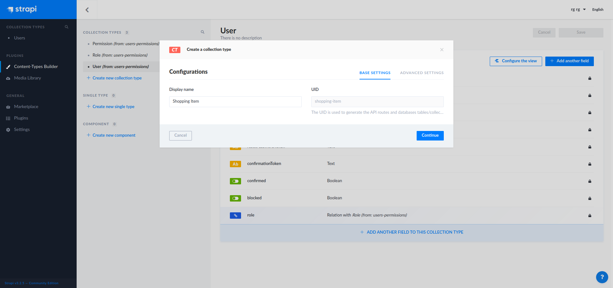

### Introduction

For a long time I wanted to set up a simple shopping list for my wife and I to keep track of what's groceries are missing at home. Whenever she / I are outside at supermarkets we can then have a list of what we need to buy without preparing in advance or texting each other.
This small project was a great way to try [React Queries](https://react-query.tanstack.com/), an awesome asynchronous data synchronization library made by [Tanner Linsley](https://github.com/tannerlinsley). For the API, I used [Strapi](https://github.com/strapi/strapi), an open source headless CMS that is perfect for my needs.

To follow this tutorial, you need to have a basic knowledge of React and React hooks (at least useState, useEffect and how to use custom hooks (from React Query)). It's also better if you understand how Aync / Await work.

For each technologies used in this tutorial, I won't cover everything, you can check the references section to understand better how each work.

You can check the code on my [Github](https://github.com/thomasprost/kaimono)

### Stack

- React
- React Query
- Strapi
- Primitive UI (small Sass boilerplate)
- Yarn (you can use npm/npx of course)

### Setting up Strapi and creating our shopping API

Strapi is an open-source headless CMS very useful to build APIs. We will use it to set up our api to manage shopping items.

First install it :

```shell
yarn create strapi-app shopping-api --quickstart
```

The Quickstart command installs Strapi using a SQLite database which is used for prototyping in development. When you'll need to deploy it to production you'll need to set it up with postgresql, mongodb, ...

Once installed, you can access the admin of your Strapi CMS. Just create your credentials and log in.

First thing you want to do is create a new Collection Type (I called it Shopping Item) and then create four fields :

- Name (Text)
- Quantity (Text is better to describe the unit of our item)
- Description (Text)
- Bought (Boolean)



Once created click Save.

Now we need to be able to query and mutate our shopping items.
On the left menu, go to Settings then Users & Permissions plugin and Roles.
Click on the Public role. In Permissions, we need to define what actions our react application will be able to access.
Our Shopping List will only need to do Create, Update, Delete and Find.


Save.

Great ! Our API is ready. That was easy.

### Setting up our React application

Create your React app with :

```bash
yarn create react-app shopping-list
// Then
cd shopping-list
```

You can now clean files and code we don't need.
As I won't cover Unit Tests in this tutorial you can remove App.test.js and setupTests.js. Clean the App.js to only keep a simple div for now.
Finally you can remove the css files generated by the Create React App boilerplate. We will replace the style by our own.

### Styling our application

This tutorial won't focus on css to keep things simple.
For this app I have used SCSS and Primitive UI as a boilerplate. It is a minimalist [Sass boilerplate](https://taniarascia.github.io/primitive) that I wanted to test for a while and that filled my needs for athis simple project.

Install it with yarn with node-sass

```bash
yarn add node-sass@4.14.1 primitive-ui
```

I used a specific version of node-sass as it seemed that newer ones had a problem.

Add a new folder styles inside src and create a main.scss file.

```scss
//==============================================================================
// Configuration
//==============================================================================

// @import "~primitive-ui/src/scss/base/variables";
@import "./base/variables";
@import "~primitive-ui/src/scss/base/mixins";

//==============================================================================
// Reset
//==============================================================================

@import "~primitive-ui/src/scss/base/normalize";
@import "~primitive-ui/src/scss/base/reset";

//==============================================================================
// Components
//==============================================================================

@import "~primitive-ui/src/scss/components/scaffolding";
@import "~primitive-ui/src/scss/components/grid";
@import "~primitive-ui/src/scss/components/helpers";
@import "~primitive-ui/src/scss/components/buttons";
@import "~primitive-ui/src/scss/components/forms";
@import "~primitive-ui/src/scss/components/tables";

//==============================================================================
// Shopping App
//==============================================================================

[type="color"],
[type="date"],
[type="datetime"],
[type="datetime-local"],
[type="email"],
[type="month"],
[type="number"],
[type="password"],
[type="search"],
[type="tel"],
[type="text"],
[type="url"],
[type="week"],
[type="time"],
select,
textarea {
  color: white;
}

#main-title {
  display: flex;
  align-items: center;
  justify-content: center;
  margin-bottom: 30px;
}

#logo {
  width: 33px;
  margin-right: 6px;
}

.side-menu {
  border-right: 1px solid $primary-color;

  h2 {
    margin-top: 0;
  }
}

.error {
  color: $error;
}

// Shopping List
#items-list {
  ul {
    padding-left: 0;
    li {
      list-style: none;
      text-transform: capitalize;
      margin: 15px 0;
      position: relative;
      padding-bottom: 12px;
      align-items: end;

      &::after {
        position: absolute;
        width: calc(100% - 1rem);
        height: 1px;
        background: $primary-color;
        left: 1rem;
        bottom: 0;
        content: "";
      }

      p {
        margin-bottom: 4px;

        &.small {
          margin: 0;
          font-size: 0.8rem;
          color: rgba($primary-color, 0.8);
        }
      }

      .actions {
        display: flex;
        justify-content: end;
        button {
          margin: 0 0 0 10px;
          height: min-content;
          padding: 12px 21px;
        }
      }
    }
  }

  .form-check {
    position: relative;
    margin-top: 10px;
    margin-bottom: 10px;
    padding-left: 0;
  }

  .form-check .form-check-label {
    min-height: 18px;
    display: block;
    margin-left: 2rem;
    line-height: 1.5;
  }
  .form-check .form-check-label input {
    position: absolute;
    top: 0;
    left: 0;
    margin-left: 0;
    margin-top: 0;
    z-index: 1;
    cursor: pointer;
    opacity: 0;
    filter: alpha(opacity=0);
    width: 30px;
    height: 30px;
  }
  .form-check .form-check-label input[type="checkbox"] + .input-frame:before,
  .form-check .form-check-label input[type="checkbox"] + .input-frame:after {
    position: absolute;
    top: 0;
    left: 0;
  }
  .form-check .form-check-label input[type="checkbox"] + .input-frame:before {
    content: "";
    width: 25px;
    height: 25px;
    border-radius: 2px;
    border: solid $primary-color;
    border-width: 2px;
    transition: all;
    transition-duration: 0s;
    transition-duration: 250ms;
  }
  .form-check .form-check-label input[type="checkbox"] + .input-frame:after {
    transition: all;
    transition-duration: 0s;
    transition-duration: 250ms;
    content: "✓";
    opacity: 0;
    filter: alpha(opacity=0);
    transform: scale(0);
    font-size: 1.9rem;
    font-weight: bold;
    color: $primary-color;
  }
  .form-check
    .form-check-label
    input[type="checkbox"]:checked
    + .input-frame:before {
    background: transparent;
  }
  .form-check
    .form-check-label
    input[type="checkbox"]:checked
    + .input-frame:after {
    width: 25px;
    opacity: 1;
    line-height: 25px;
    filter: alpha(opacity=100);
    -webkit-transform: scale(1);
    -ms-transform: scale(1);
    -o-transform: scale(1);
    transform: scale(1);
  }
  .form-check
    .form-check-label
    input[type="checkbox"]:disabled
    + .input-frame:before {
    border-color: #e8ebf1;
  }
  .form-check
    .form-check-label
    input[type="checkbox"]:disabled:checked
    + .input-frame:after {
    background: #e8ebf1;
    color: #ffffff;
  }
}

// Edit Form specific
.edit-actions {
  display: flex;
  justify-content: space-between;
}

//Responsive

@media only screen and (max-width: $desktop) {
  .side-menu {
    order: 2;
    border: none;
  }
}
```

You can load the base variable file from primitive ui (Uncomment the first line of the scss main file) or replace it with your own ([As I did](https://github.com/thomasprost/kaimono/blob/master/src/styles/base/_variables.scss))
There is nothing very fancy in the css, it just redesigns a few elements needed in our app like our item list, the Edit and Add forms.

Import our newly created scss file into index.js

```javascript{3}{numberLines: true}
import React from "react";
import ReactDOM from "react-dom";
import "./styles/index.scss";
import App from "./App";
```

### Creating the structure of the shopping app

Our application will be simple and structured as is:

- App (the main container)
  - Shopping List (Fetch items from the API)
    - Single Item
  - Forms
    - Add Item
    - Edit Item

Let's start by creating our main app. In App.js, we can remove everything and add:

```javascript{numberLines:true}
import React, { useState } from "react";
import ShoppingList from "./components/ShoppingList";

function App() {
  return (
    <div className="container">
      <div className="content">
        <h1 id="main-title">Shopping List</h1>
        <div className="flex-row">
          <div className="flex-large one-fourths side-menu">
            {/* Space for edit and add forms */}
          </div>
          <div className="flex-small three-fourths">
            <ShoppingList />
          </div>
        </div>
      </div>
    </div>
  );
}

export default App;
```

Forms will be displayed in a panel on the left (25% of the size) and the rest will display the shopping list.

Let's now create ou Shopping List. Create a new folder called components that will hold our ... components:
In components/ShoppingList.jsx:

```javascript{numberLines:true}
import React from "react";
import Item from "./Item";

const data = [];

function ShoppingList(props) {
  return (
    <div id="items-list">
      {status === "loading" ? (
        <span>Loading...</span>
      ) : status === "error" ? (
        <span>Error</span>
      ) : (
        <ul>
          {data
            ? data.map(item => {
                return <Item key={item.id} item={item}></Item>;
              })
            : "Nothing to buy"}
        </ul>
      )}
    </div>
  );
}

export default ShoppingList;
```

For now, data is just an empty array. Once we set up React Query, we will update this section.

Finally, let's prepare our Single Item component :

```javascript{numberLines:true}
import React from "react";

function Item(props) {
  const item = props.item;

  return (
    <li className="flex-row">
      <div className="flex-large three-fourths">
        <div className="form-check">
          <label className="form-check-label">
            <input
              type="checkbox"
              checked={item.Bought}
              className="form-check-input"
            />
            {item.Name} | {item.Quantity}
            <i className="input-frame"></i>
          </label>
        </div>
        <p className="small">{item.Info}</p>
      </div>
      <div className="flex-large one-fourths actions">
        <button>
          <svg
            viewBox="0 0 24 24"
            width="24"
            height="24"
            stroke="currentColor"
            strokeWidth="2"
            fill="none"
            strokeLinecap="round"
            strokeLinejoin="round"
            className="css-i6dzq1"
          >
            <path d="M12 20h9"></path>
            <path d="M16.5 3.5a2.121 2.121 0 0 1 3 3L7 19l-4 1 1-4L16.5 3.5z"></path>
          </svg>
        </button>
        <button>
          <svg
            viewBox="0 0 24 24"
            width="24"
            height="24"
            stroke="currentColor"
            strokeWidth="2"
            fill="none"
            strokeLinecap="round"
            strokeLinejoin="round"
            className="css-i6dzq1"
          >
            <polyline points="3 6 5 6 21 6"></polyline>
            <path d="M19 6v14a2 2 0 0 1-2 2H7a2 2 0 0 1-2-2V6m3 0V4a2 2 0 0 1 2-2h4a2 2 0 0 1 2 2v2"></path>
            <line x1="10" y1="11" x2="10" y2="17"></line>
            <line x1="14" y1="11" x2="14" y2="17"></line>
          </svg>
        </button>
      </div>
    </li>
  );
}

export default Item;
```

For now, don't worry about the props passed by parent (shopping List component), once we set up React Query to get data from our strapi API, everything will get clearer.
Item component is a sinmple list item that displays our product name, quantity and description (See strapi section). We add a check box to display if an item was bought and two buttons, Edit and Delete. I used Feather icons to style these two buttons.

### Adding React Query

So as to query our API, we will set up [React Query](https://github.com/tannerlinsley/react-query). Check the full documentation for a deeper understanding on how everything works.

Let's install it:

```bash
yarn add react-query
```

/!\ Useful Tip :
I won't cover it here but React Query DevTools is very handy to understand how queries are made, cache, updates and so on. You can install it set it up from [here](https://react-query.tanstack.com/docs/devtools).

Now in our Shopping List:

```javascript{3,5,6,7,8,11,12,13,14,22,24}{numberLines:true}
import React from "react";
import Item from "./Item";
import { useQuery } from "react-query";

const fetchShoppingItems = async () => {
  const res = await fetch("http://localhost:1337/shopping-items");
  return res.json();
};

// giving a name to our Query (shopping) will help us managing cache in other components
function ShoppingList(props) {
  const { status, data, error, refetch } = useQuery(
    "shopping",
    fetchShoppingItems
  );

  return (
    <div id="items-list">
      {status === "loading" ? (
        <span>Loading...</span>
      ) : status === "error" ? (
        <span>
          Error: {error.message}
          <br />
          <button onClick={() => refetch()}>Retry</button>
        </span>
      ) : (
        <ul>
          {data && data.length > 0
            ? data.map(item => {
                return <Item key={item.id} item={item}></Item>;
              })
            : "Nothing to buy"}
        </ul>
      )}
    </div>
  );
}

export default ShoppingList;
```

The first big change in our list component is a asynchronous function that will fetch all our items from our API and return the json response.

the second change, inside our component, is the useQuery hook provided by React Query library. It helps us fetching the data and get status informations on what is happening, if en error happened, a callback function to refetch the data...

#### Add Form

Now that we can display our items, let's create an Add form to add new items. Inside components/Forms folder, create AddItemForm.jsx

```javascript{numberLines:true}
import React, { useState } from "react";
import { useMutation, useQueryCache } from "react-query";

// This is a simple async POST fetch function passing
// our form data from state to our API
export const postItem = async body => {
  const settings = {
    method: "POST",
    headers: {
      Accept: "application/json",
      "Content-Type": "application/json",
    },
    body: JSON.stringify(body),
  };
  try {
    const fetchResponse = await fetch(
      `http://localhost:1337/shopping-items`,
      settings
    );
    const data = await fetchResponse.json();
    return data;
  } catch (e) {
    return e;
  }
};

function AddItemForm(props) {
  // The cache hook will help invalidate our data when we add an item
  const cache = useQueryCache();
  const initialFormState = { Name: "", Quantity: "", Info: "" };
  const [item, setItem] = useState(initialFormState);

  // We bind our form input elements to React
  // and automatically update our state on user input change
  const handleInputChange = event => {
    const { name, value } = event.target;
    setItem({ ...item, [name]: value });
  };

  // On form submit, use the Mutation hook provided by React query
  // and the function set up to update our data
  const handleFormSubmit = event => {
    event.preventDefault();
    mutate(item);
    setItem(initialFormState);
  };

  const [mutate, { error }] = useMutation(postItem, {
    onSuccess: () => {
      cache.invalidateQueries("shopping");
    },
  });

  return (
    <div>
      {error && <div className="error">{error.message}</div>}
      <h2>Add an Item</h2>
      <form onSubmit={handleFormSubmit}>
        <label>Name</label>
        <input
          type="text"
          name="Name"
          value={item.Name}
          onChange={handleInputChange}
        />
        <label>Quantity</label>
        <input
          type="text"
          name="Quantity"
          value={item.Quantity}
          onChange={handleInputChange}
        />
        <label>Info</label>
        <input
          type="text"
          name="Info"
          value={item.Info}
          onChange={handleInputChange}
        />
        <br />
        <button onClick={handleFormSubmit}>Add item</button>
      </form>
    </div>
  );
}

export default AddItemForm;
```

#### Edit Form

So as to know which item is being edited, we are going to manage an item ID through a state shared by our components. So as to share this state easily, we will set it up in the parent, App.js:

```javascript{2,4,9,16,17,18,19,20,21,22,23,24,25,28}{numberLines:true}
import React, { useState } from "react";
import AddItemForm from "./components/Forms/AddItemForm";
// we are going to create it just after
import EditItemForm from "./components/Forms/EditItemForm";
import ShoppingList from "./components/ShoppingList";

function App() {
  // Our item id being edited
  const [editingIndex, setEditingIndex] = useState(null);
  return (
    <div className="container">
      <div className="content">
        <h1 id="main-title">Shopping List</h1>
        <div className="flex-row">
          <div className="flex-large one-fourths side-menu">
            {editingIndex !== null ? (
              <>
                <EditItemForm
                  editingIndex={editingIndex}
                  setEditingIndex={setEditingIndex}
                />
              </>
            ) : (
              <AddItemForm />
            )}
          </div>
          <div className="flex-small three-fourths">
            <ShoppingList setEditingIndex={setEditingIndex} />
          </div>
        </div>
      </div>
    </div>
  );
}

export default App;
```

We need to pass the setEditingIndex function to the ShoppingList component because the Item will update this index inside its form.

Now that we have updated our app to manage edit index state, let's add a new component EditItemForm.jsx in components/Forms.

```javascript{numberLines:true}
import React, { useState, useEffect } from "react";
import { useMutation, useQueryCache, useQuery } from "react-query";

const emptyItem = {
  Name: "",
  Quantity: "",
  Info: "",
};

// Fetch One item
export const fetchItemById = async (key, { id }) => {
  const res = await fetch(`http://localhost:1337/shopping-items/${id}`);

  return res.json();
};

// Update one item
// Same post function in AddForm, we pass as body our form and use PUT method in fetch
export const patchItem = async body => {
  const settings = {
    method: "PUT",
    headers: {
      Accept: "application/json",
      "Content-Type": "application/json",
    },
    body: JSON.stringify(body),
  };
  try {
    const fetchResponse = await fetch(
      `http://localhost:1337/shopping-items/${body.id}`,
      settings
    );
    const data = await fetchResponse.json();
    return data;
  } catch (e) {
    return e;
  }
};

function EditItemForm({ editingIndex, setEditingIndex }) {
  const cache = useQueryCache();

  // Don't attempt to query until editingIndex is truthy
  const { data } = useQuery(["item", { id: editingIndex }], fetchItemById, {
    enabled: editingIndex !== null,
  });

  // Update our item and invalidate cache on Success
  const [mutate] = useMutation(patchItem, {
    onSuccess: data => {
      // Update `items` query when this mutation succeeds
      cache.invalidateQueries("shopping");
      cache.setQueryData(["item", { id: editingIndex }], data);
      setEditingIndex(null);
    },
  });

  // Initial state of our item inside form
  const [item, setItem] = useState(data || emptyItem);

  // Lifecycle event when our component is mounted
  useEffect(() => {
    if (editingIndex !== null && data) {
      setItem(data);
    } else {
      setItem(emptyItem);
    }
  }, [data, editingIndex]);

  // Bind input fields to our local state
  const handleInputChange = event => {
    const { name, value } = event.target;
    setItem({ ...item, [name]: value });
  };

  // Mutate our item when form is submitted
  const handleFormSubmit = event => {
    event.preventDefault();
    mutate(item);
  };

  return (
    <>
      <h2>Editing {item.Name}</h2>
      {item && (
        <form onSubmit={handleFormSubmit}>
          <label>Name</label>
          <input
            type="text"
            name="Name"
            value={item.Name}
            onChange={handleInputChange}
          />
          <label>Quantity</label>
          <input
            type="text"
            name="Quantity"
            value={item.Quantity}
            onChange={handleInputChange}
          />
          <label>Info</label>
          <input
            type="text"
            name="Info"
            value={item.Info}
            onChange={handleInputChange}
          />
          <br />
          <div className="edit-actions">
            <button onClick={handleFormSubmit}>Update item</button>
            <button onClick={() => setEditingIndex(null)}>Cancel</button>
          </div>
        </form>
      )}
    </>
  );
}

export default EditItemForm;
```

We can now update our ShoppingList component to pass setEditingIndex to the Item component.

ShoppingList.jsx

```javascript{8}{numberLines:true}
{
  data && data.length > 0
    ? data.map(item => {
        return (
          <Item
            key={item.id}
            item={item}
            setEditingIndex={props.setEditingIndex}
          ></Item>
        );
      })
    : "Nothing to buy";
}
```

Finally, update the Item.jsx

```javascript{numberLines:true}
import React from "react";
// highlight-start
import { useMutation, useQueryCache } from "react-query";
// highlight-end

// Update item when checkbox is updated to know
// if a product was bought or not
// highlight-start
export const patchItem = async body => {
  const settings = {
    method: "PUT",
    headers: {
      Accept: "application/json",
      "Content-Type": "application/json",
    },
    body: JSON.stringify(body),
  };
  try {
    const fetchResponse = await fetch(
      `http://localhost:1337/shopping-items/${body.id}`,
      settings
    );
    const data = await fetchResponse.json();
    return data;
  } catch (e) {
    return e;
  }
};

// Delete
export const deleteItem = async id => {
  const settings = {
    method: "DELETE",
    headers: {
      Accept: "application/json",
      "Content-Type": "application/json",
    },
  };
  try {
    const fetchResponse = await fetch(
      `http://localhost:1337/shopping-items/${id}`,
      settings
    );
    const data = await fetchResponse.json();
    return data;
  } catch (e) {
    return e;
  }
};
// highlight-end

function Item(props) {
  const item = props.item;
  // highlight-start
  const cache = useQueryCache();

  const handleRemoveItem = event => {
    event.preventDefault();
    mutate(item.id);
    props.setEditingIndex(null);
  };

  const [mutate, { error }] = useMutation(deleteItem, {
    onSuccess: () => {
      cache.invalidateQueries("shopping");
    },
  });

  const [mutatePatch] = useMutation(patchItem, {
    onSuccess: () => {
      cache.invalidateQueries("shopping");
    },
  });

  const updateChecked = event => {
    mutatePatch({ ...item, Bought: !item.Bought });
  };
  // highlight-end

  return (
    <li className="flex-row">
      // highlight-start
      {error && <div className="error">{error.message}</div>}
      // highlight-end
      <div className="flex-large three-fourths">
        <div className="form-check">
          <label className="form-check-label">
            <input
              type="checkbox"
              checked={item.Bought}
              className="form-check-input"
              // highlight-start
              onChange={updateChecked}
              // highlight-end
            />
            {item.Name} | {item.Quantity}
            <i className="input-frame"></i>
          </label>
        </div>
        <p className="small">{item.Info}</p>
      </div>
      <div className="flex-large one-fourths actions">
        <button
          // highlight-start
          onClick={() => {
            props.setEditingIndex(item.id);
          }}
          // highlight-end
        >
          <svg
            viewBox="0 0 24 24"
            width="24"
            height="24"
            stroke="currentColor"
            strokeWidth="2"
            fill="none"
            strokeLinecap="round"
            strokeLinejoin="round"
            className="css-i6dzq1"
          >
            <path d="M12 20h9"></path>
            <path d="M16.5 3.5a2.121 2.121 0 0 1 3 3L7 19l-4 1 1-4L16.5 3.5z"></path>
          </svg>
        </button>
        // highlight-start
        <button onClick={handleRemoveItem}>
          // highlight-end
          <svg
            viewBox="0 0 24 24"
            width="24"
            height="24"
            stroke="currentColor"
            strokeWidth="2"
            fill="none"
            strokeLinecap="round"
            strokeLinejoin="round"
            className="css-i6dzq1"
          >
            <polyline points="3 6 5 6 21 6"></polyline>
            <path d="M19 6v14a2 2 0 0 1-2 2H7a2 2 0 0 1-2-2V6m3 0V4a2 2 0 0 1 2-2h4a2 2 0 0 1 2 2v2"></path>
            <line x1="10" y1="11" x2="10" y2="17"></line>
            <line x1="14" y1="11" x2="14" y2="17"></line>
          </svg>
        </button>
      </div>
    </li>
  );
}
export default Item;
```

When the user clicks on edit button, the Item Id is updated through the function passed as props. The Edit Form then shows up (Add form gets hidden) and allows the user to update an item.
Delete button is now bound to a mutate hook that will call our API to delete the item.
