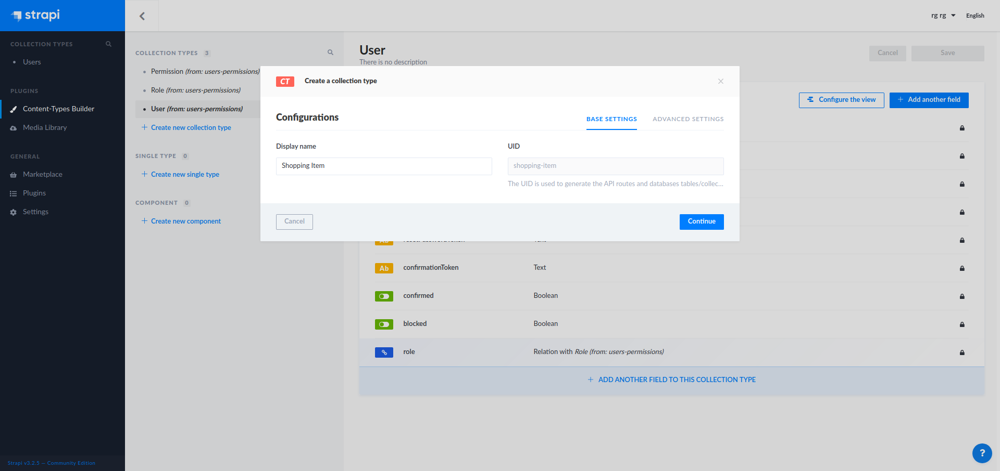
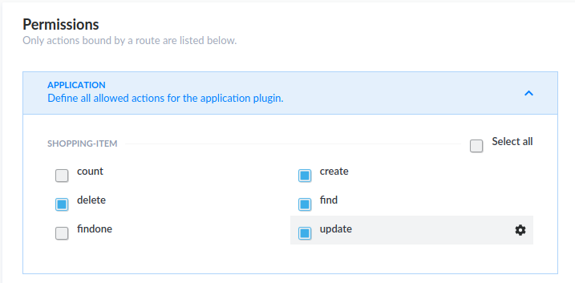

### Introduction

For a long time I wanted to set up a simple shopping list for my wife and I to keep track of what's groceries are missing at home. Whenever she / I are outside at supermarkets we can then have a list of what we need to buy without preparing in advance or texting each other.
This small project was a great way to try [React Queries](https://react-query.tanstack.com/), an awesome asynchronous data synchronization library made by [Tanner Linsley](https://github.com/tannerlinsley). For the API, I used [Strapi](https://github.com/strapi/strapi), an open source headless CMS that is perfect for my needs.

To follow this tutorial, you need to have a basic knowledge of React and React hooks (at least useState, useEffect and how to use custom hooks (from React Query)).

For each technologies used in this tutorial, I won't cover everything, you can check the references section to understand better how each work.

### Stack

- React
- React Query
- Strapi
- Primitive UI (small Sass boilerplate)
- React Content Loader
- Yarn (you can use npm/npx of course)

### Setting up Strapi and creating our shopping API

Strapi is an open-source headless CMS very useful to build APIs. We will use it to set up our api to manage shopping items.

First install it :

```shell
yarn create strapi-app shopping-api --quickstart
```

The Quickstart command installs Strapi using a SQLite database which is used for prototyping in development.

Once installed, you can access the admin of your Strapi CMS. Just create your credentials and log in.

First thing you want to do is create a new Collection Type (I called it Shopping Item) and then create four fields :

- Name (Text)
- Quantity (Text is better to describe the unit of our item)
- Description (Text)
- Bought (Boolean)



Once created click Save.

Now we need to be able to query and mutate our shopping items.
On the left menu, go to Settings then Users & Permissions plugin and Roles.
Click on the Public role. In Permissions, we need to define what actions our react application will be able to access.
Our Shopping List will only need to do Create, Update, Delete and Find.



Save.

Great ! Our API is ready. That was easy.

### Setting up our React application

Create your React app with :

```bash
yarn create react-app shopping-list
// Then
cd shopping-list
```

You can now clean files and code we don't need.
As I won't cover Unit Tests in this tutorial you can remove App.test.js and setupTests.js. Clean the App.js to only keep a simple div for now.
Finally you can remove the css files generated by the Create React App boilerplate. We will replace the style by our own.

### Styling our application

This tutorial won't focus on css to keep things simple.
For this app I have used SCSS and Primitive UI as a boilerplate. It is a minimalist [Sass boilerplate](https://taniarascia.github.io/primitive) that I wanted to test for a while and that filled my needs for athis simple project.

Install it with yarn with node-sass

```bash
yarn add node-sass@4.14.1 primitive-ui
```

I used a specific version of node-sass as it seemed that newer ones had a problem.

Add a new folder styles inside src and create a main.scss file.

```scss
//==============================================================================
// Configuration
//==============================================================================

// @import "~primitive-ui/src/scss/base/variables";
@import "./base/variables";
@import "~primitive-ui/src/scss/base/mixins";

//==============================================================================
// Reset
//==============================================================================

@import "~primitive-ui/src/scss/base/normalize";
@import "~primitive-ui/src/scss/base/reset";

//==============================================================================
// Components
//==============================================================================

@import "~primitive-ui/src/scss/components/scaffolding";
@import "~primitive-ui/src/scss/components/grid";
@import "~primitive-ui/src/scss/components/helpers";
@import "~primitive-ui/src/scss/components/buttons";
@import "~primitive-ui/src/scss/components/forms";
@import "~primitive-ui/src/scss/components/tables";

//==============================================================================
// Shopping App
//==============================================================================

[type="color"],
[type="date"],
[type="datetime"],
[type="datetime-local"],
[type="email"],
[type="month"],
[type="number"],
[type="password"],
[type="search"],
[type="tel"],
[type="text"],
[type="url"],
[type="week"],
[type="time"],
select,
textarea {
  color: white;
}

#main-title {
  display: flex;
  align-items: center;
  justify-content: center;
  margin-bottom: 30px;
}

#logo {
  width: 33px;
  margin-right: 6px;
}

.side-menu {
  border-right: 1px solid $primary-color;

  h2 {
    margin-top: 0;
  }
}

.error {
  color: $error;
}

// Shopping List
#items-list {
  ul {
    padding-left: 0;
    li {
      list-style: none;
      text-transform: capitalize;
      margin: 15px 0;
      position: relative;
      padding-bottom: 12px;
      align-items: end;

      &::after {
        position: absolute;
        width: calc(100% - 1rem);
        height: 1px;
        background: $primary-color;
        left: 1rem;
        bottom: 0;
        content: "";
      }

      p {
        margin-bottom: 4px;

        &.small {
          margin: 0;
          font-size: 0.8rem;
          color: rgba($primary-color, 0.8);
        }
      }

      .actions {
        display: flex;
        justify-content: end;
        button {
          margin: 0 0 0 10px;
          height: min-content;
          padding: 12px 21px;
        }
      }
    }
  }

  .form-check {
    position: relative;
    margin-top: 10px;
    margin-bottom: 10px;
    padding-left: 0;
  }

  .form-check .form-check-label {
    min-height: 18px;
    display: block;
    margin-left: 2rem;
    line-height: 1.5;
  }
  .form-check .form-check-label input {
    position: absolute;
    top: 0;
    left: 0;
    margin-left: 0;
    margin-top: 0;
    z-index: 1;
    cursor: pointer;
    opacity: 0;
    filter: alpha(opacity=0);
    width: 30px;
    height: 30px;
  }
  .form-check .form-check-label input[type="checkbox"] + .input-frame:before,
  .form-check .form-check-label input[type="checkbox"] + .input-frame:after {
    position: absolute;
    top: 0;
    left: 0;
  }
  .form-check .form-check-label input[type="checkbox"] + .input-frame:before {
    content: "";
    width: 25px;
    height: 25px;
    border-radius: 2px;
    border: solid $primary-color;
    border-width: 2px;
    transition: all;
    transition-duration: 0s;
    transition-duration: 250ms;
  }
  .form-check .form-check-label input[type="checkbox"] + .input-frame:after {
    transition: all;
    transition-duration: 0s;
    transition-duration: 250ms;
    content: "✓";
    opacity: 0;
    filter: alpha(opacity=0);
    transform: scale(0);
    font-size: 1.9rem;
    font-weight: bold;
    color: $primary-color;
  }
  .form-check
    .form-check-label
    input[type="checkbox"]:checked
    + .input-frame:before {
    background: transparent;
  }
  .form-check
    .form-check-label
    input[type="checkbox"]:checked
    + .input-frame:after {
    width: 25px;
    opacity: 1;
    line-height: 25px;
    filter: alpha(opacity=100);
    -webkit-transform: scale(1);
    -ms-transform: scale(1);
    -o-transform: scale(1);
    transform: scale(1);
  }
  .form-check
    .form-check-label
    input[type="checkbox"]:disabled
    + .input-frame:before {
    border-color: #e8ebf1;
  }
  .form-check
    .form-check-label
    input[type="checkbox"]:disabled:checked
    + .input-frame:after {
    background: #e8ebf1;
    color: #ffffff;
  }
}

// Edit Form specific
.edit-actions {
  display: flex;
  justify-content: space-between;
}

//Responsive

@media only screen and (max-width: $desktop) {
  .side-menu {
    order: 2;
    border: none;
  }
}
```

You can load the base variable file from primitive ui (Uncomment the first line of the scss main file) or replace it with your own ([As I did](https://github.com/thomasprost/kaimono/blob/master/src/styles/base/_variables.scss))
There is nothing very fancy in the css, it just redesigns a few elements needed in our app like our item list, the Edit and Add forms.

Import our newly created scss file into index.js

```javascript{3}
import React from "react";
import ReactDOM from "react-dom";
import "./styles/index.scss";
import App from "./App";
```

### Creating the structure of the shopping app

### Adding React Query

### Setting up Environment variables

Until now we have been using an hard coded url in our api queries though it's not maintainable nor easy to deploy on production.

Thus we will define an environment variable for our API url

There are different ways to manage environment variables, in this project we will use a .env file to store them.

At the root create two files : .env and .env.local

.env is usually used as an example with dummy values that will be commited to source control (Never commit real production values / secrets into git/svn/...)

.env.local will override .env and won't be commited to source control. This way, we can create a .env.local in each of our environments (local dev, staging, production, ...) without polluting source control.

From [Create React App](https://create-react-app.dev/docs/adding-custom-environment-variables/) :

> Note: You must create custom environment variables beginning with REACT_APP. Any other variables except NODE_ENV will be ignored to avoid accidentally exposing a private key on the machine that could have the same name. Changing any environment variables will require you to restart the development server if it is running.

For now, let's just add a new variable in .env.local :

```
REACT_APP_API_URL=http://localhost:1337/
```

We can do the same in .env file as it's only a local url, nothing secret here. Next time you or another developer pull from the repository, just copy .env into .env.local file and replace the url with the one you need for your environment.

We can now update our Queries.js file to use our variable:

```
const apiUrl = process.env.REACT_APP_API_URL;
```

and replace each hard-coded urls with our new constant, for example:

```javascript{1}
const res = await fetch(`${apiUrl}shopping-items/${id}`);
```

### React content loader to improve user experience

### Deploying our Application and API

### Future Improvements

### References
