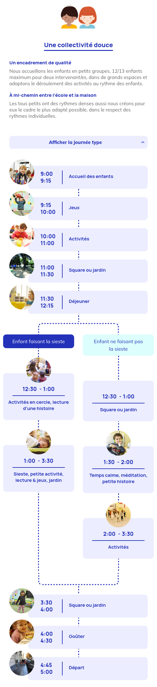
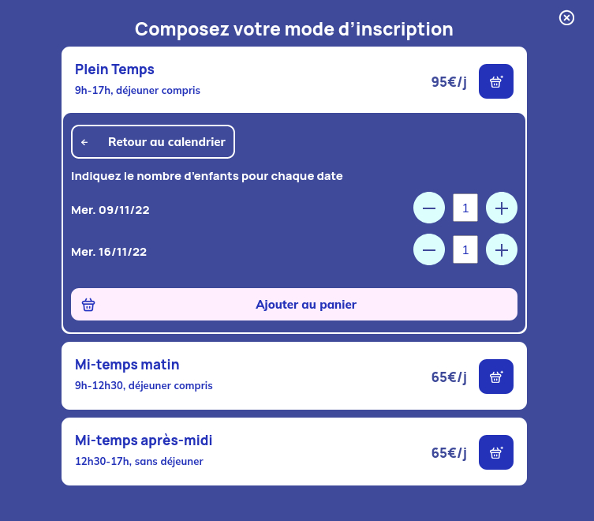

### Client & Besoins

123 Mon école est une école Montessori basée à Paris. Elle s'est développée au fil des années et ouvre régulièrement de nouvelles écoles. Pour quatre de celles-ci, l'équipe avait besoin d'un renouvellement complet de leur e-commerce pour faciliter la vente d'activités extrascolaires.

### Challenges

123 Mon école souhaitait une plateforme de e-commerce puissante qui puisse être facilement mise à jour par des néophytes. L'un des objectifs principaux était de donner la possibilité aux parents de l'école d'enregistrer les informations relatives à leurs enfants et de lier facilement celles-ci aux activités. Cela impliquait une personnalisation totale du compte et des processus d'achat pour répondre parfaitement à ces besoins.

### Solutions

En utilisant WooCommerce, j'ai pu entièrement personnaliser l'expérience utilisateur tout en m'appuyant sur l'interface bien connue de Wordpress pour les admins de 123 Mon école. Les hooks et filtres de WooCommerce m'ont beaucoup aidé à adapter le comportement de la boutique tout en évitant de trop dépendre des extensions et et ainsi garder un site rapide.

### Détails & intéractions

- Les admins peuvent facilement créer différents types d'activités. Certaines peuvent être sélectionnées par date et heure, d'autres ont des conditions spécifiques pour être ajoutées au panier, ...
- Présenter clairement les activités et la vie de l'école
- Les parents peuvent ajouter des informations propres à leurs enfants et les affecter à des activités en toute simplicité lors du passage au panier.
- Gérez tous les courriels et factures en fonction de différents scénarii.

## Site web

### Etude de cas Mobile - Déroulé d'une journée

### Etude de cas Portail

### Etude de cas Calendrier

