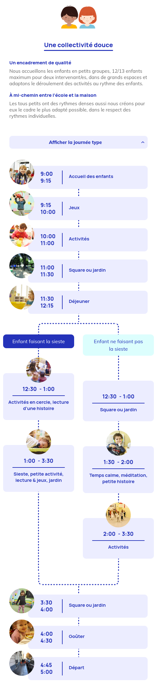
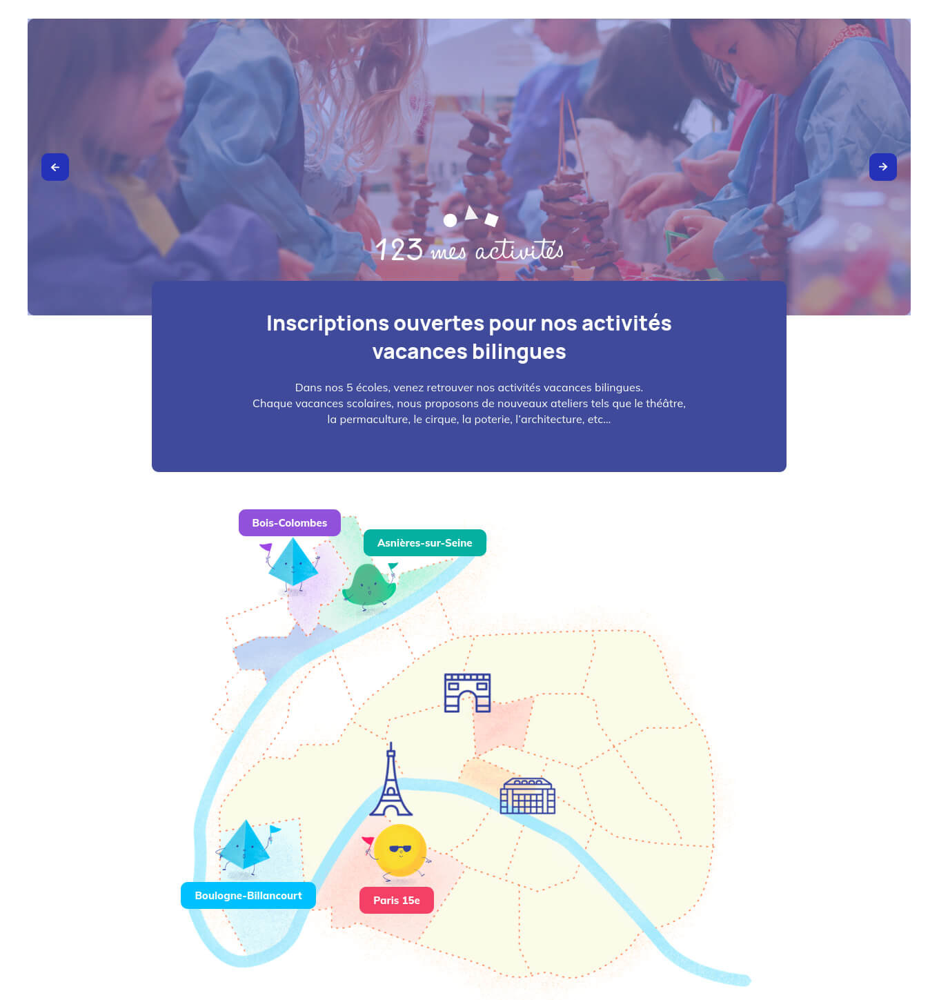
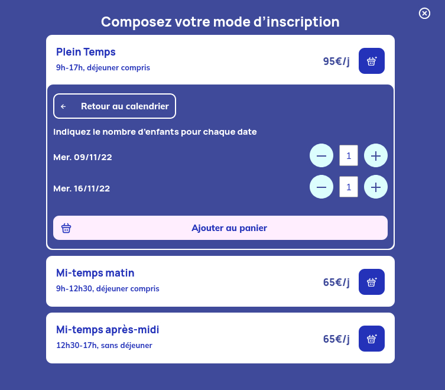

### Client & Needs

123 Mon école is a Montessori school based in Paris. They have been growing over the years and are opening new schools often. For four of their schools, they needed a complete renewal of their e-commerce to make buying afterschool activities an easier process.

### Challenges

123 Mon école wanted a powerful e-commerce platform that could be easily updated by their non-technical staff. Their focus was having the possibility for parents of the school to create their account, register their children's information and link easily activities to different kids. That meant totally customising the account and purchase processes to fit their needs perfectly.

### Solutions

By using WooCommerce, I knew that I could fully customize the user experience while still relying on Wordpress well known interface for 123 Mon école's administrators. WooCommerce hooks and filters helped me a lot adapting the e-commerce behaviour to avoid relying too much on third parties' extension and keeping a fast website.

### Details & interactions

- Admins can easily create different kinds of activities. Some can be selectable by date and hour, some having specific conditions to be added to cart, ...
- Presents activities and life at the school
- Parents can add children's information and assign them to activities smoothly during checkout.
- Manage all emails and invoices to fit different scenarios

## Website

### Case study Mobile - Day Program

### Case study Portail

### Case study Calendar

