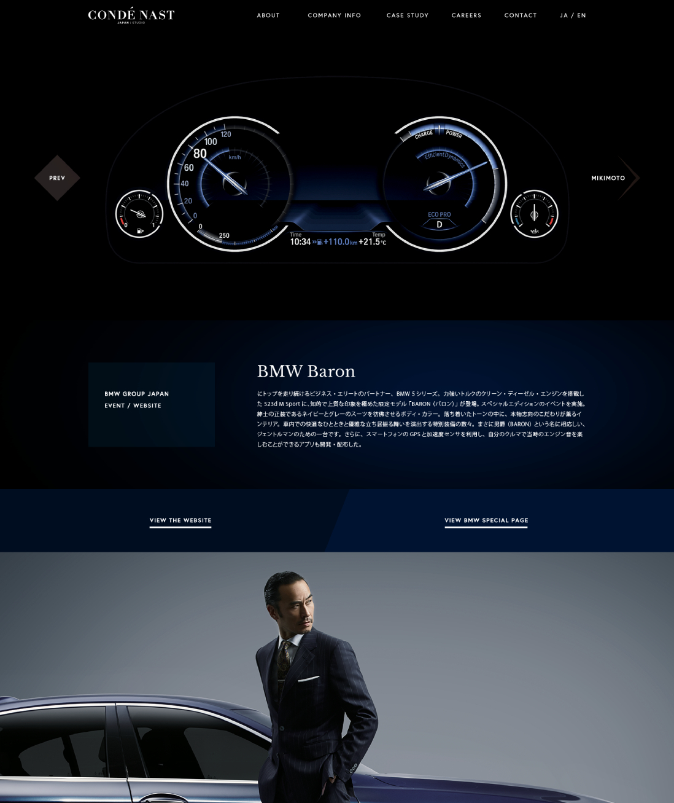

CondéNast est un groupe mondial d'édition de magazines notamment connu pour publier, entre autres, Vogue, Wired et Vanity Fair. Sa section agence créative (CondéNast Studio) avait besoin d'un site web localisé pour présenter ses projets au marché japonais. En tant qu'unique développeur sur le site, mon travail a consisté à créer tout de A à z, que ce soit l'architecture, le backend et l'intégration du design. Basé sur Symfony 3, je me suis évertué à produire un site rapide, facile à maintenir pour mettre à jour les projets et bien documenté.

## Site Web

### Case Study détail

### Case Study liste

