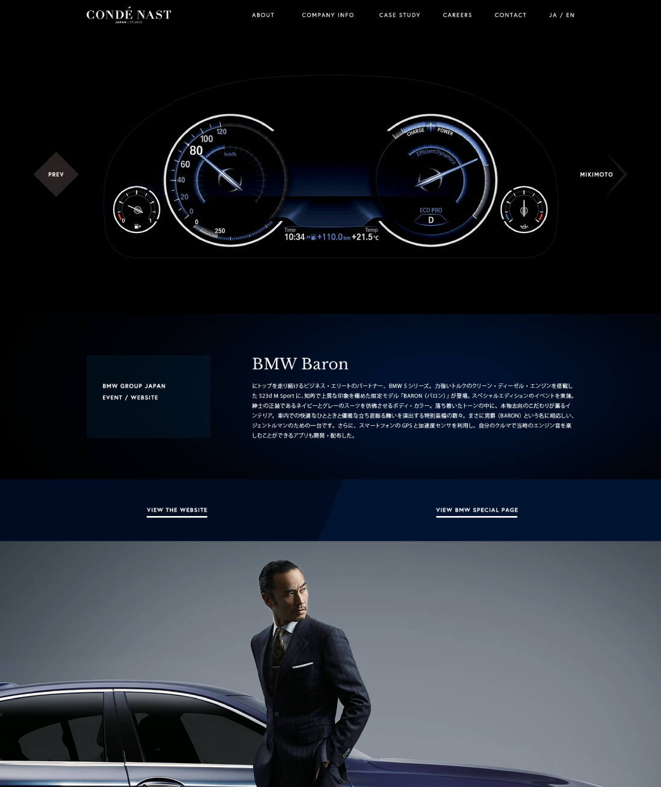
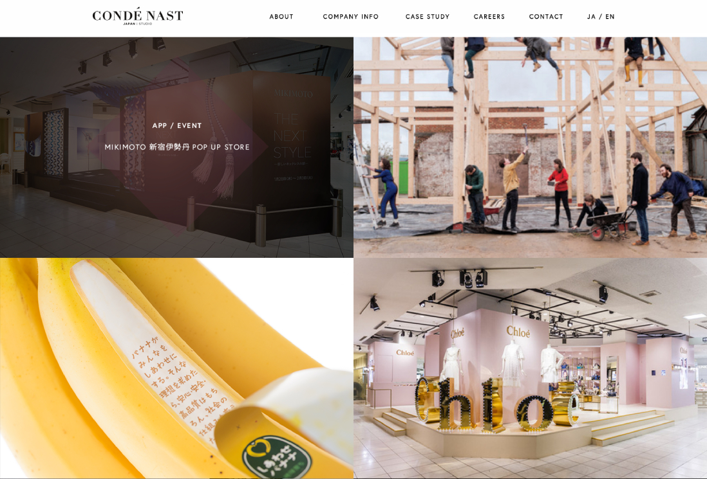

CondéNast is a mass media group famous, among many other things, for publishing magazines like Vogue, Wired or Vanity Fair. They needed a localized website for Japan to present their creative studio along with their projects. As the developer of the website, I took care of both the backend and frontend sides using Symfony3 and focusing on site speed and ease of use for administrators.

## Website

### Case Study details

### Case Study list

