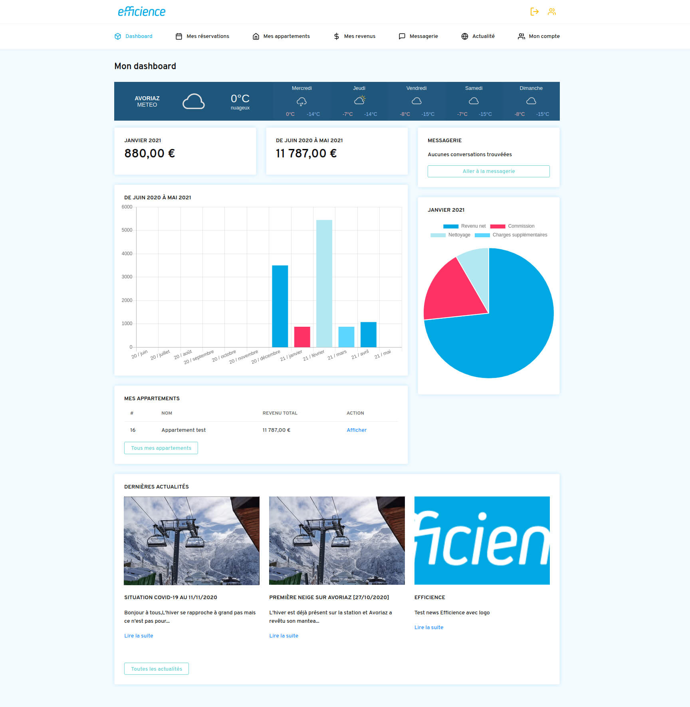
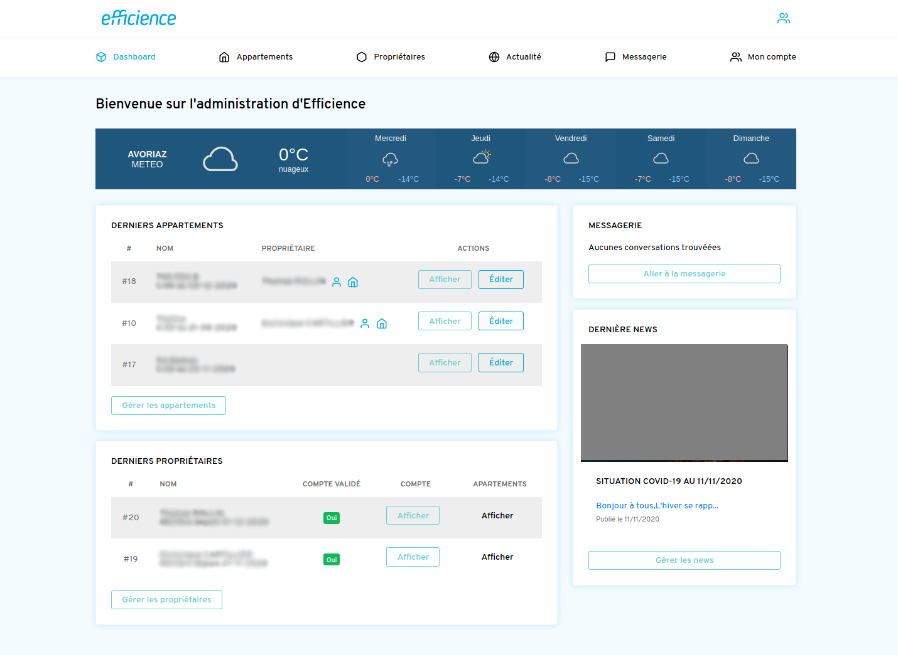
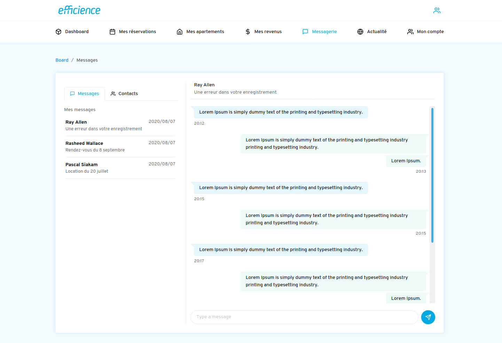

Efficience est un nouveau service privé aidant les propriétaires d'appartements à gérer leurs locations. Grâce à cette application Web, ils peuvent désormais voir facilement l'occupation de leurs appartements et leurs revenus sous forme de graphiques. L'objectif principal du client était:

- Pour les utilisateurs d'avoir une interface simple mais complète pour voir leurs revenus.
- Pour l'administrateur de gérer les appartements, les propriétaires et de communiquer avec eux via l'application.

Le backend et le frontend ont été réalisés sous Symfony 5. La section de messagerie asynchrone utilise elle Symfony pour les requetes / formater / préparer les données et React pour les afficher dynamiquement.

Tout au long du projet, j'ai essayé de me focaliser sur la rapidité générale de l'interface, et sa simplicité d'accès.

## Website

### Case study Board Accueil

### Case study Calendrier

### Case study Admin

### Case study Messagerie

