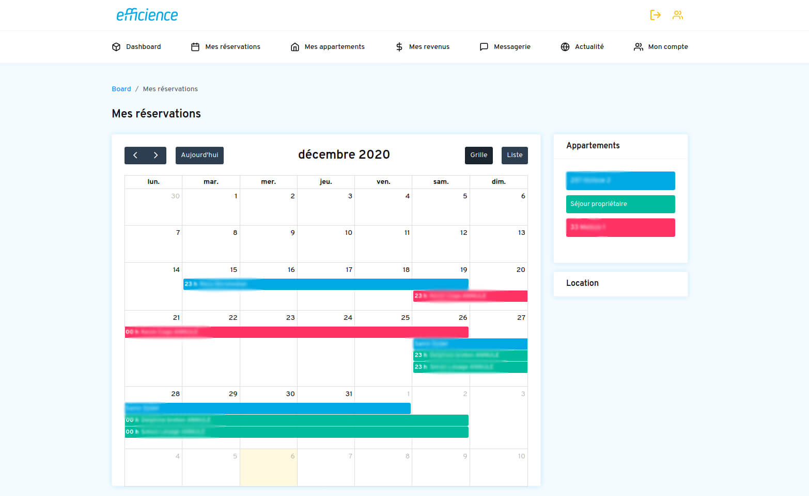
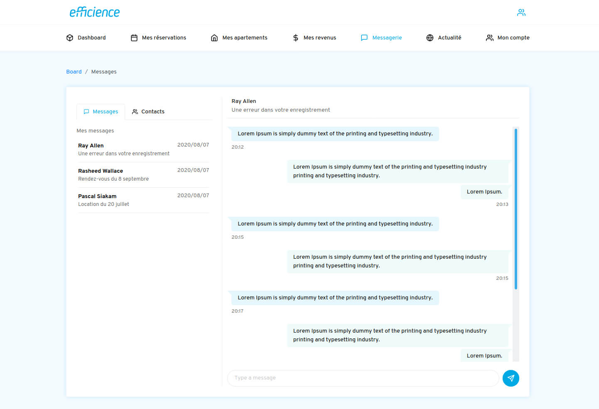

Efficience is a new private service to help apartments owners to manage their rentals. Thanks to this web app, they now can see their earnings and meaningful statistics about their apartments through charts. The main focus for the client was :

- For end users to have a simple yet complete interface to see their earnings and occupancy.
- For the administrator to manage appartments, owners and to communicate with them through the application.

Both backend and frontend were made with PHP framework Symfony 5. The asynchronous messaging section is using Symfony to query / format / serve data and React to display them smoothly.

All along the project I tried to focus on keeping the codebase clean as the features were getting more complex and on enhancing the application general speed.

## Website

### Case study Board home

### Case study Calendar

### Case study Admin home

### Case study Messaging

