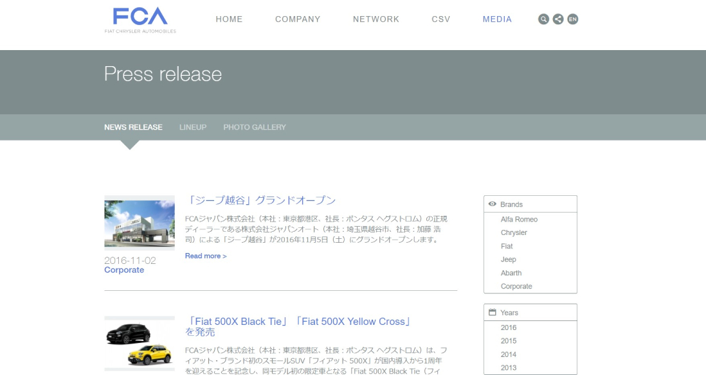

Lors de la création du consortium de constructeurs automobiles FCA (Fiat Chrysler Automobiles), le besoin était d'avoir un site web localisé et adapté au Japon. Outre les pages statiques décrivant leur entreprise, le site devait afficher les actualités de FCA dans différentes langues avec la possibilité de les filtrer facilement par marques, années et mois. En tant que développeur full-stack, mon rôle consistait à tout créer, que ce soit le schéma de la base de données, une administration permettant de gérer les actualités avec des galeries photos et un site totalement responsive. Le site a été créé avec le framework PHP Symfony2.

## Site web

### Page d'accueil

### Page de news

