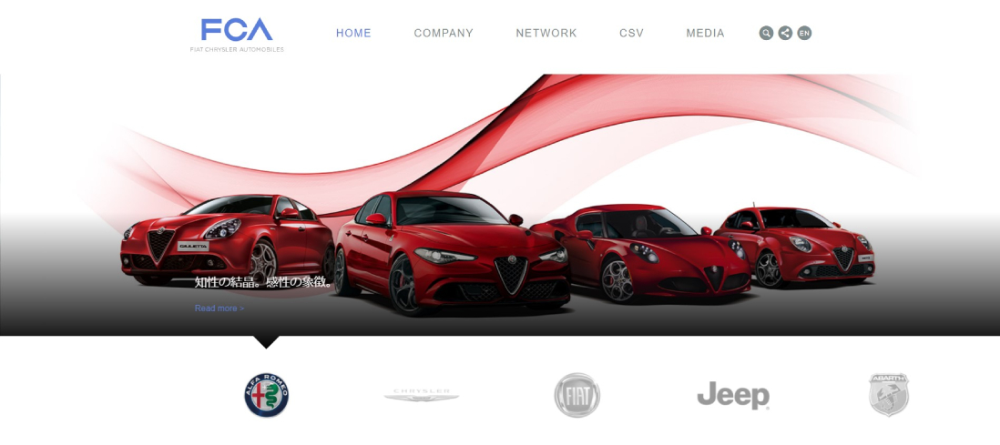
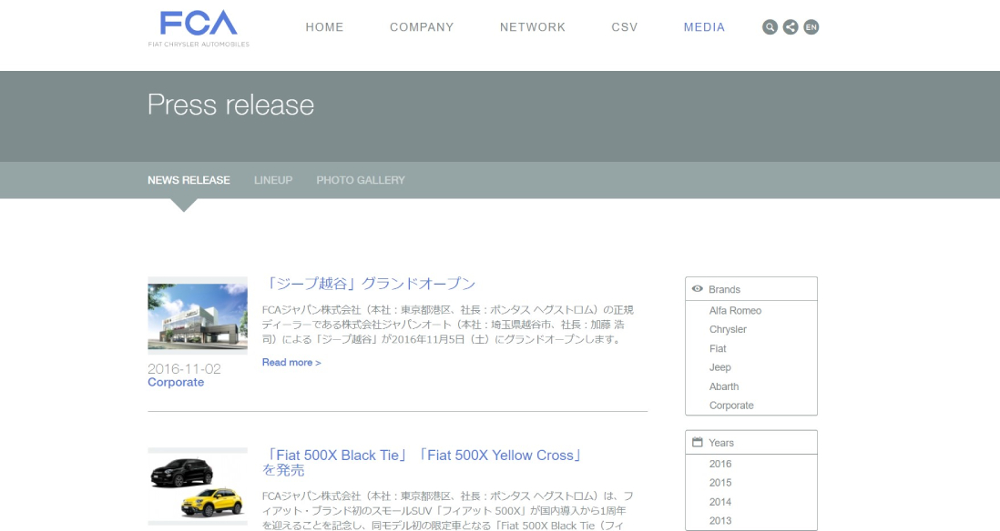

When the consortium of car manufacturers FCA (Fiat Chrysler Automobiles) was created, they needed a website localized for Japan. In addition to static pages to describe their company, they needed to display news in different languages with the possibility to easily filter news by Brands, Years and Months. As a full stack developer, my role was to create everything from the database schema, a backend to manage news with photo galleries and make a fully responsive frontend. The site was made in PHP’s Symfony2 framework.

## Website

### Home Page

### News Page

