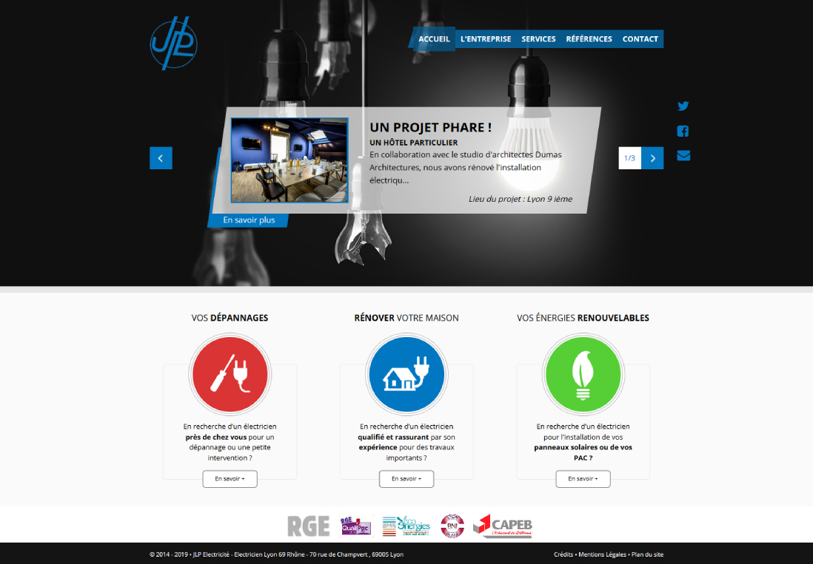
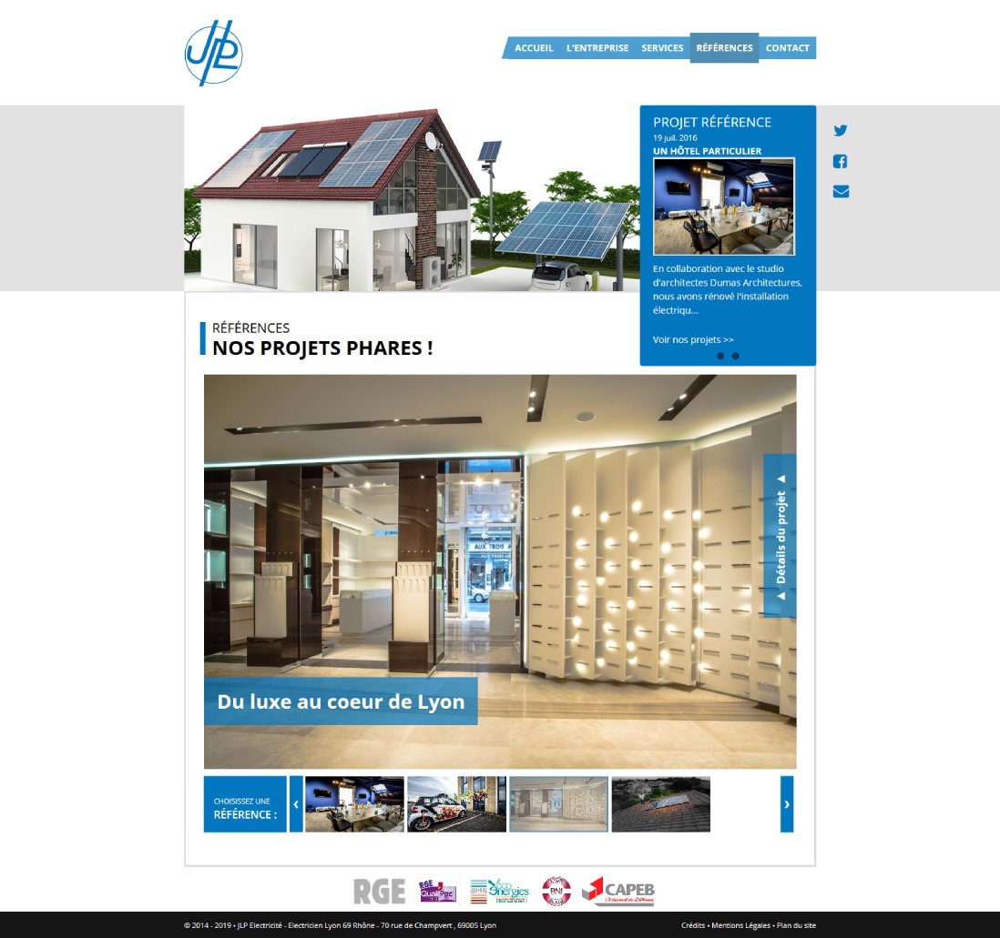

Basée dans l’Ouest lyonnais JLP Electricité a débutée comme entreprise d'électricité il y a plus de 30 ans. En forte expansion ces dernières années, ils ont étendus leurs gammes de services pour se tourner vers l'avenir et travailler notamment dans l'énergie durable et la mobilité verte. Ils avaient besoin d'une refonte de leur site web pour présenter leur entreprise et services. Basé sur Asp.Net MVC 4, je me suis occupé de créer une administration pour qu'ils puissent ajouter de nouveaux projets ainsi que d'intégrer le design du graphiste.

## Site web

### Page d'accueil

### Page de projets

