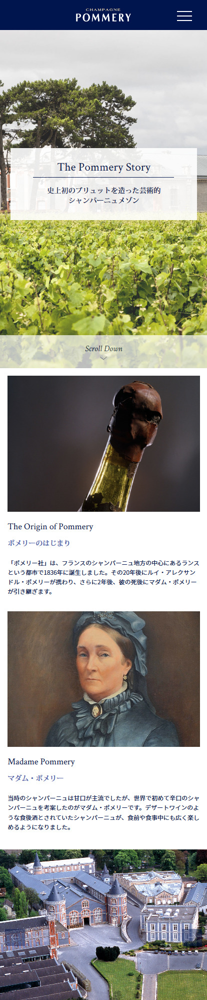

Maison de Champagne mondialement reconnue, Pommery est basée à Reims et fut créée en 1858. Basé sur Symfony 3, le site s'évertue à garder l'image luxueuse de la marque et à l'adapter au marché japonais.

## Site web

### Page d'accueil

### Page d'histoire de la maison Pommery

