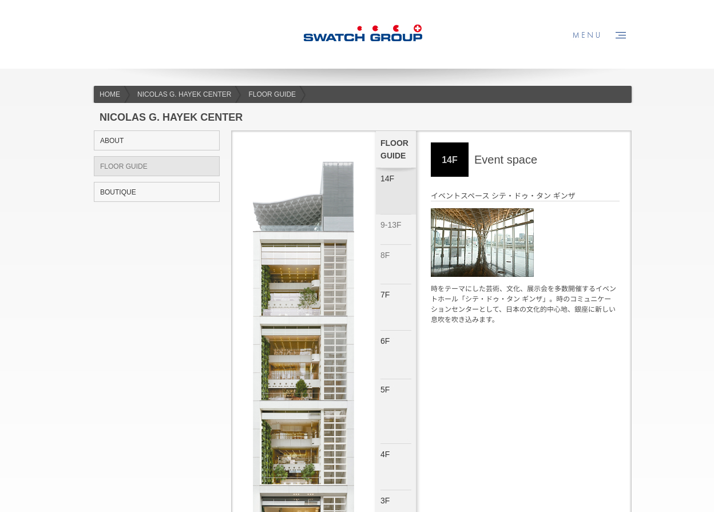
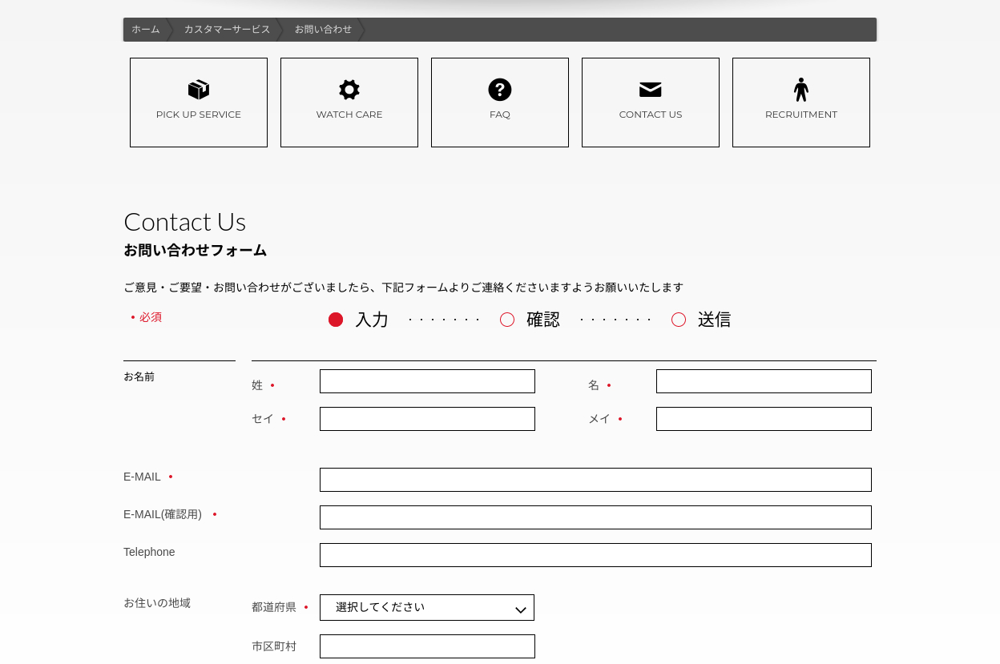

### Clients et besoins

Swatch Group est un groupe international spécialisé dans la conception, la fabrication et la vente de montres, bijoux, horlogerie ainsi que leurs composants.
Ils distribuent 12 marques au Japon (Breguet, Calvin Klein, Tissot, ...).

Il y a quelques années maintenant, l'un de mes clients a développé le site Web de Swatchgroup Japon et l'administre toujours. Bien que le design soit toujours d'actualité et qu'ils n'aient aucun problème à le gérer et le mettre à jour, ils avaient besoin d'aide pour migrer le backend et améliorer la sécurité. Symfony1 était un bon framework à l'époque de la création du site mais, avec PHP 5, est devenu assez obsolète. N'étant plus maintenu, pour éviter toute faille importante de sécurité, il était important de migrer sur une nouvelle version.

**Mon travail sur le projet a consisté à migrer le framework et le serveur vers la dernière version de Symfony / PHP**

Symfony 1 étant trop différent des versions plus récentes de Symfony, il n'était pas possible de simplement migrer le framework et de débugger quelques éléments.

Je suis parti d'une nouvelle installation de Symfony 5 avec PHP 8.0 et Mariadb comme base de données.

### Développement local / Docker

- Apache
- Php 8
- Mariadb 10.5
- Yarn (pour compiler des assets avec Webpack Encore)

### Étapes principales

- Recréer le schéma de la base de données avec basé sur les entités Symfony.
- Migrer complètement les templates pour utiliser Twig
- Mettre à jour les contrôleurs et séparer les requêtes de base de données (Doctrine) via leurs repositories
- Gérez les assets et améliorez les performances grâce à Webpack Encore.
- Améliorez la sécurité de l'administration avec le bundle de sécurité et un nouveau pare-feu.
- Configurer le nouveau serveur avec Apache, PHP 8, Mariadb, Yarn et Git.

## Site Internet

### Étude de cas Accueil

### Étude de cas CENTRE NICOLAS G. HAYEK

### Étude de cas Formulaire de contact

