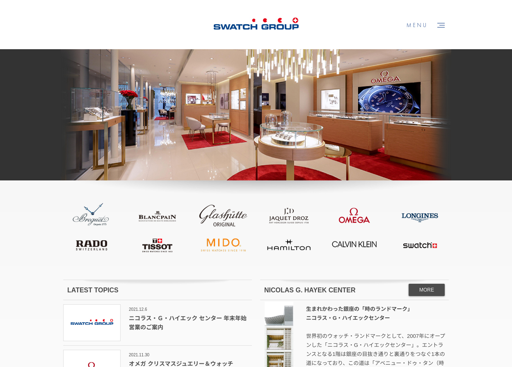
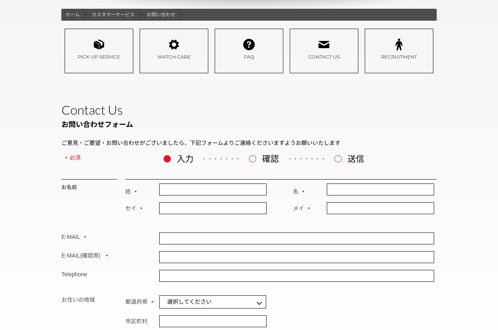

### Clients and Needs

Swatch Group is an international group active in the design, manufacture and sale of finished watches, jewelry, watch movements and components.
They operate 12 watch brands in Japan(Breguet, Calvin Klein, Tissot, ...).

The current Swatchgroup Japan website was made by one of my clients a long time ago. While the design is still great and they have no problems managing and updating it, they needed help on updating the backend and improving security. Symfony1 was a good framework at the time the site was made but now is fairly outdated.

**My job on the project was to migrate the framework and server to the latest version of Symfony**

Symfony 1 being too different from newer versions of Symfony, just migrating the framework and debugging a few things wasn't an option.

I started from a fresh Symfony5 install with PHP8.0 and Mariadb as database.

### Local Development / Docker stack

- Apache
- Php 8
- Mariadb 10.5
- Yarn (to compile assets with Webpack Encore)

### Main steps

- Recreate the database schema with Symfony Entities
- Fully migrate views to use Twig templating
- Update controllers and separate database queries (Doctrine) through their own repositories
- Manage assets and improve performances with Webpack Encore.
- Improve admin security with the security bundle and a new firewall.
- Configure the new server with Apache, PHP 8, Mariadb, Yarn and Git.

## Website

### Case study Home

### Case study NICOLAS G. HAYEK CENTER

### Case study Contact Form

