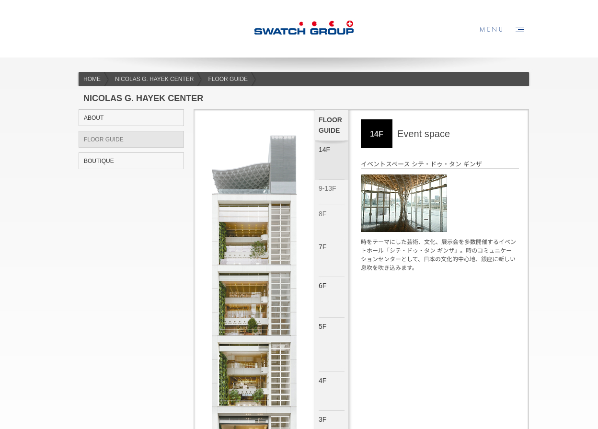

Swatch Group is an international group active in the design, manufacture and sale of finished watches, jewelry, watch movements and components.
They operate 12 watch brands in Japan.

One of my client which made and manages the Swatchgroup Japan website needed help. My job was to migrate an old Symfony 1 project and server to a brand new Symfony 5 website.
Symfony 1 being too different from newer versions of Symfony, just migrating the framework and debugging a few things wasn't an option.

## Website

### Case study Home

### Case study NICOLAS G. HAYEK CENTER

