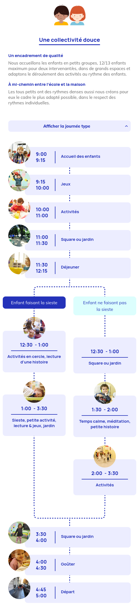
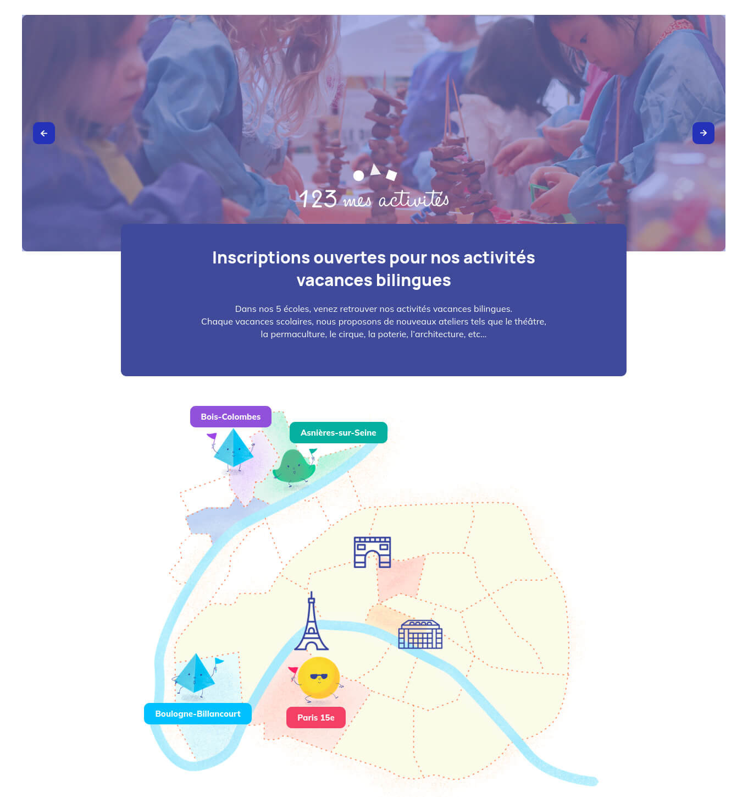
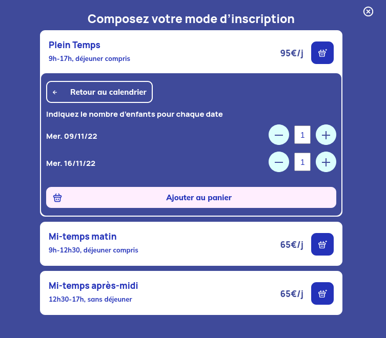

### Client & Needs

Taiwan+ (TaiwanPlus) is a free English-language streaming service that aims to deliver information, news, and videos that showcase what’s happening in Taiwan and examine world events that affect the nation. They needed a microsite to showcase the beseen instagram campaign and their community insights.

### Challenges

- Create a responsive, fast and easy to update website in a very short amount of time
- Have a way to pull instagram posts from different accounts / hashtags and moderate them in admin
- Improve security to make common hacks less prone to succeeding

### Solutions

With the Tokyo based web agency Relativ\*, we worked

### Details & interactions

- Admins can easily create different kinds of activities. Some can be selectable by date and hour, some having specific conditions to be added to cart, ...
- Presents activities and life at the school
- Parents can add children's information and assign them to activities smoothly during checkout.
- Manage all emails and invoices to fit different scenarios

## Website

### Case study Mobile - Day Program

### Case study Portail

### Case study Calendar

