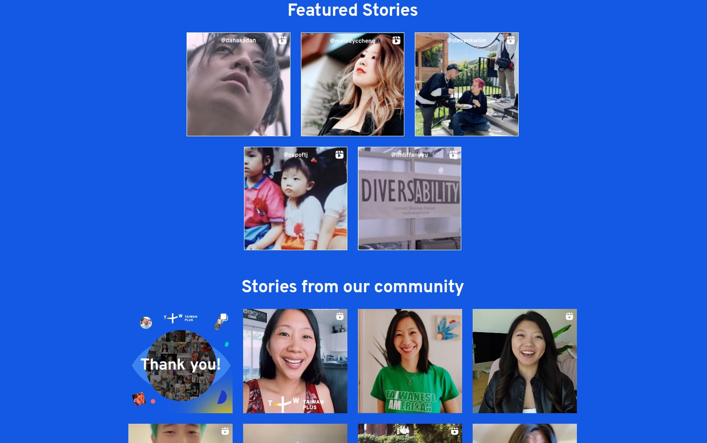
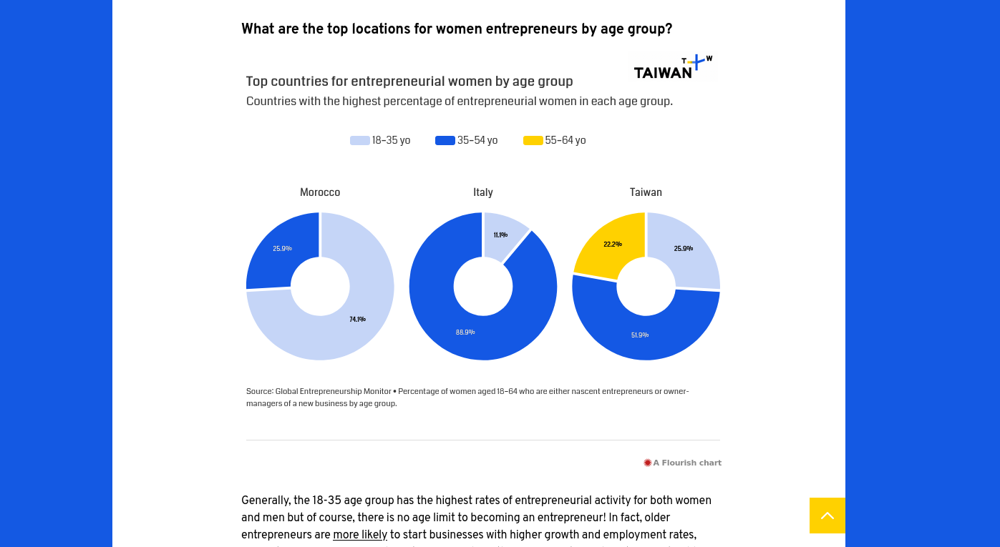

### Client & Needs

Taiwan+ (TaiwanPlus) is a free English-language streaming service that aims to deliver information, news, and videos that showcase what’s happening in Taiwan and examine world events that affect the nation. They needed a microsite to showcase the beseen instagram campaign and their community insights.

### Challenges

- Create a responsive, fast and easy to update website in a very short amount of time
- Have a way to pull instagram posts from different accounts / hashtags and moderate them in admin
- Improve security to make common hacks less prone to succeeding

### Solutions

With the Tokyo based web agency Relativ\*, we created a two parts microsite :

- The #Beseenweek campaign to promote under-represented stories from the community shared through Instagram. On their side, Taiwanplus worked with influencers to share their IG reels on the page.
- The "Women in Business" page, a white paper studying the gender cap in entrepreneurship and how Taiwan compares on the global stage.

## Website

### Case study Beseen IG campaign

### Case study Women in Business

