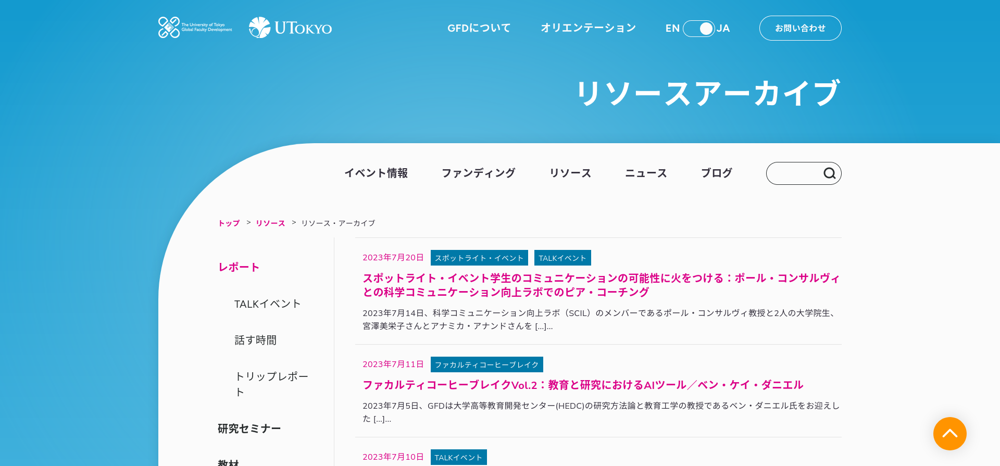

### Client & besoins

La GFD (Global Faculty Development Initiative at the College of Arts and Sciences) de l'Université de Tokyo vise à promouvoir l'excellence de l'enseignement parmi ses professeurs proposant des cours dans des langues non japonaises. Ses missions sont les suivantes :

- Préparer les professeurs, actuels et futurs, à des techniques d'enseignement efficaces et centrées sur l'apprenant.
- Former des instructeurs capables d'enseigner le contenu des cours dans des langues autres que le japonais.
- S'engager activement dans l'échange d'idées et la recherche sur le développement global des facultés.

Avec un site web vieux, peu performant et compliqué à mettre à jour, GFD avait besoin d'une refonte complète de son site couplé à un back-office plus simple à prendre en main.

### Challenges

- Créer un site web responsive, rapide et facile à mettre à jour pour des utilisateurs peu habitués au web.
- Améliorer la lisibilité des événements à venir et des rapports d'événements.
- Organiser correctement les différents types de données et médias (événements, ressources, rapports, actualités).
- Simplifier la traduction du contenu de l'anglais vers le japonais.

### Solutions

Avec l'agence web Relativ\*, basée à Tokyo, qui était en charge de la conception et de la partie QA, nous avons :

- Créé un site web WordPress entièrement responsive et multilingue avec Weglot pour l'internationalisation.
- Thème sur mesure avec champs et types d'articles personnalisés pour simplifier la gestion du contenu et avoir plus de contrôle sur sa mise en page.
- Meilleure présentation du calendrier Google pour conserver la puissance de l'outil tout en le rendant plus facile à comprendre que l'affichage par défaut.
- Réorganisation des événements et des rapports d'événements et ainsi améliorer grandement leurs découvertes par les utilisateurs.

## Site web

### Étude de cas Accueil Anglais

### Étude de cas Rapports Japonais

