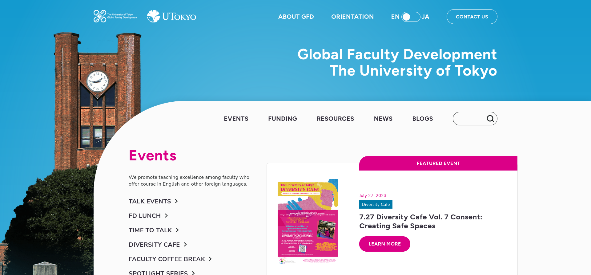
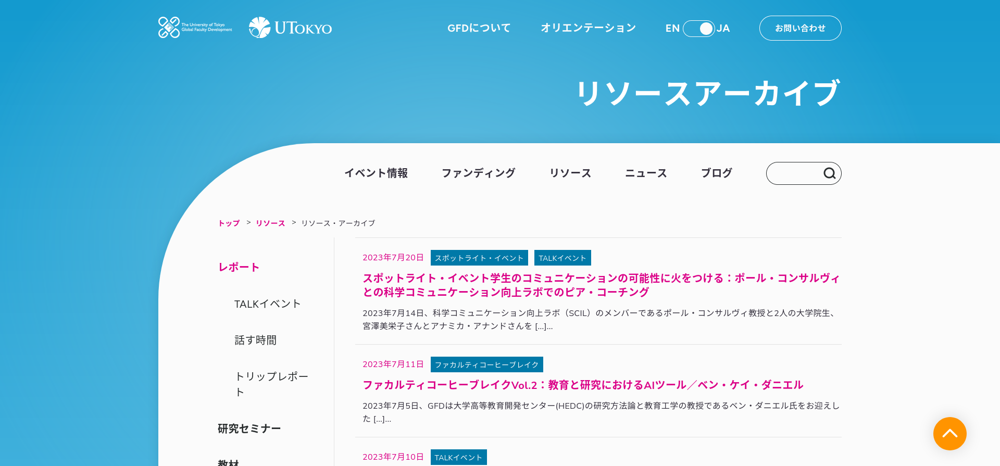

### Client & Needs

The Global Faculty Development Initiative at the College of Arts and Sciences at the University of Tokyo aims to promote teaching excellence among the instructors who offer courses in non-Japanese languages. Its missions are :

- Expose current and future faculty to effective, learner-centered teaching techniques.
- Nurture instructors who can teach content courses in languages other than Japanese.
- Actively engage in exchange of ideas and research on global faculty development.

With an old and slow website that was complicated to update, GFD needed a complete design renewal with a simple to use back office.

### Challenges

- Create a responsive, fast and easy to update website for non tech-savvy users.
- Improve readability for upcomming events and past reports.
- Organize properly the many different types of data and media (events, resources, reports, news)
- Simplify the translations of content from English to Japanese

### Solutions

With the Tokyo based web agency Relativ\*, who was in charge of the design and QA, we:

- Created a fully responsive and multilingual WordPress website with Weglot for the internationalization.
- Tailored a custom-made theme with custom post types and fields to manage easily content and layouts of pages.
- Better presentation of Google Calendar to keep the power of the tool while making it easier to understand than the default IFrame.
- Reorganize events and reports to make them easier to discover by end users.

## Website

### Case study Home English

### Case study Reports Japanese

