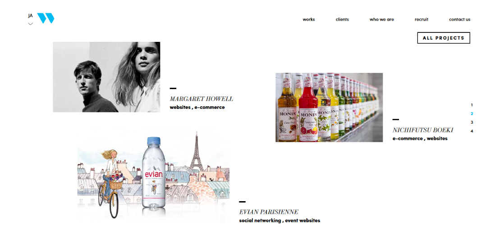
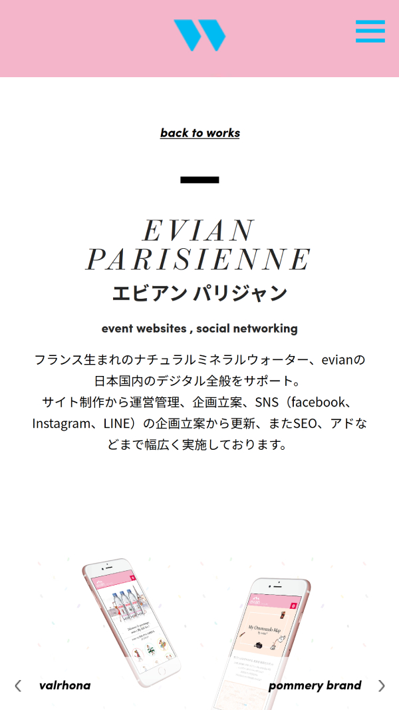

De nombreuses agences digitales préfèrent externaliser le développement de leurs propres sites web pour se focaliser sur les projets de leurs clients. C'est toujours compliqué de bloquer du temps pour un projet interne. En tant que développeur chez Warp Japan K.K., j'ai toujours essayé d'être rigoureux dans la qualité de mon code, avoir des sites faciles à maintenir pour les administrateurs et avec d'excellentes performances. Avec l'aide de nos designers, nous voulions non seulement mettre en avant notre agence et les projets de nos clients mais aussi montrer nos compétences techniques. Le site tourne sous Symfony 3 avec Grunt la compilation et Compass pour le framework Css. Le site, totalement responsive, a toujours 97% sur Pagespeed de Google après plusieurs années de mise en service.

## Site web

### Page case study liste

### Page responsive case study détails

