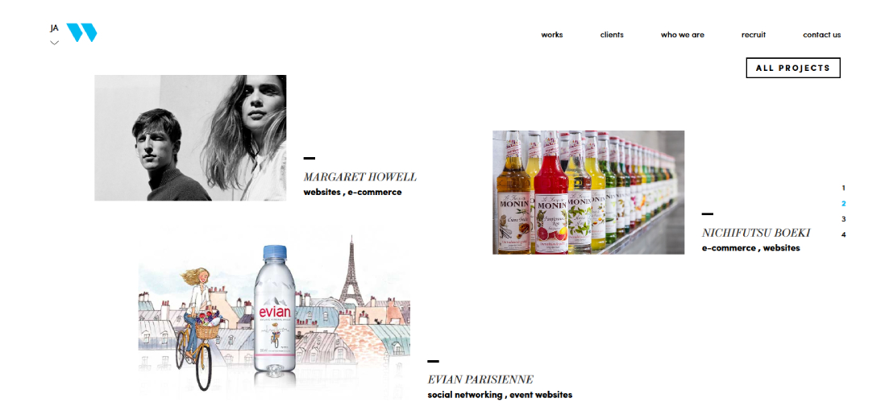

Many digital agencies outsource their own website development so as to only focus on clients projects. It is always difficult to make up some time for an internal project when already busy. As a developer at WarpJapan, I always tried to focus on great code quality, easy maintenance for the site's administrators and performances. With the help of our designers, we wanted to not only present our company and projects we were working on but also show our technical skills. The site is running on Symfony3 with Grunt to compile assets and Compass framework for the Css. After a few years running the fully responsive site has still a 97% score on Google Page Speed.

## Website

### Case study list page

### Case study responsive details page

