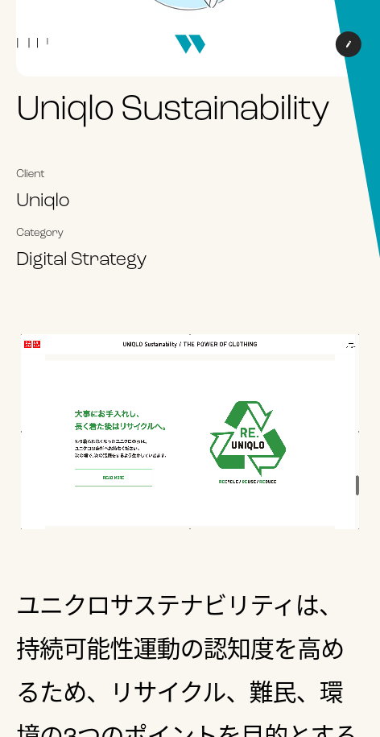

### Client et besoins

En 2021, l'agence digitale WarpJapan a eu besoin de renouveler son site web. Ils aimaient leur site actuel mais se sentaient trop limités pour promouvoir leurs projets et leur culture.
Ils m'ont fait confiance pour trouver des solutions à la fois pour le frontend / backend et pour intégrer leur nouveau design.

### Esthétique

Leurs designers se sont basés sur des formes arrondies et une grande typographie pour apporter une sensation de dynamisme tout en étant fun et moderne.

### Histoire et contenu

Pour mieux expliquer qui ils sont, leur vidéo showreel sert d'introduction au nouveau site.
Ils sont convaincus que chaque client et chaque projet est unique. À présent, les études de cas, leurs processus et les résultats de leurs travaux occupent une place bien plus centrale.

### Détails et interactions

- Une nouvelle façon de représenter le menu hamburger. L'interaction des quatre lignes verticales se crée à partir des lettres elles-mêmes.
- Smooth scroll
- Transition de page sur le portfolio
- Arrière-plan basé sur une typographique flottante

### Développement

Les principaux objectifs de WarpJapan pour leur nouveau site web étaient :

- Des animations dynamiques et modernes
- Facilité de maintenance en interne
- Rapidité
- Garder le multilingue

Avec tout cela en tête, j'ai choisi de le développer en utilisant Nextjs avec un CMS headless (Prismic) pour gérer les données.
Nextjs a permis de créer de belles transitions tout en ayant la puissance du Server Side Rendering et de la génération statique des pages. Le tout donne un rendu fluide et rapide. La simplicité de l'édition du contenu sur Prismic a également permis de faire la transition facilement avec le site Web précédent tout en gérant facilement le multilingue.

## Site web

### Étude de cas Portfolio - Norwegian Rain

### Étude de cas Team

### Étude de cas Portfolio Responsive - Uniqlo

